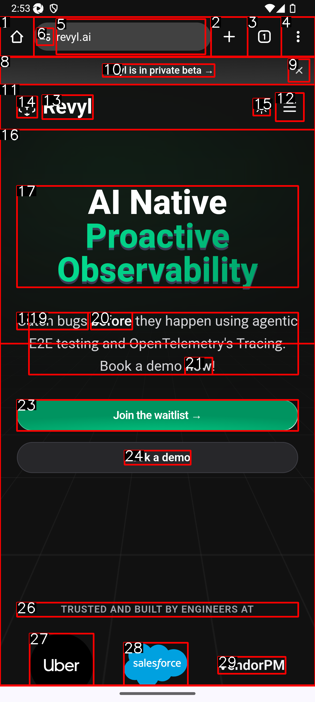

# CogniSIM: Crossplatform Mobile LLM Agents

For cross platform LLM agentic testing

Control and get LLM readable state from IOS and ANDROID


## Documentation

For full documentation, visit [mobileadapt.revyl.ai](https://mobileadapt.revyl.ai).


## Key Features

- **Android Support**: Works seamlessly with Android devices and emulators.

- **IOS Support**: Works seamlessly with Android devices and emulators.
- **Appium Integration**: Leverages the power of Appium for reliable mobile automation.
- **LLM Agent Compatibility**: Designed to work seamlessly with language model agents.
- **iOS Support**: Coming soon!


## How does it work?

We use Appium under the hood to control the device and collect the UI. We then use a custom UI parser to convert the UI to a string that can be used by the LLM.


The UI is parsed with a ui parser and then set of mark is generated for the image and we send that to the LLM..

The UI is parsed with a ui parser and then a set of marks is generated for the image, and we send that to the LLM. For example, the parsed UI might look like this:

```   html
<html>
  <button id=0">None</button>
  <button id=1 class="home_button">Open the home page</button>
  <button id=2 class="optional_toolbar_button">New tab</button>
  <button id=3 class="tab_switcher_button">Switch or close tabs</button>
  <button id=4 class="menu_button">Customize and control Google Chrome</button>
  <input id=5 class="url_bar">revyl.ai</input>
  
  <p id=7">None</p>
  
  <button id=9">Dismiss banner</button>
  <p id=10">Revyl is in private beta →</p>
  <p id=11">None</p>
  <button id=12">Menu</button>
  <p id=13">Revyl</p>
  <button id=14">None</button>
  <button id=15">None</button>
  <p id=16">None</p>
  <p id=17">AI Native Proactive Observability</p>
  <p id=18">Catch bugs</p>
  <p id=19">they happen using agentic E2E testing and OpenTelemetry's Tracing. Book a demo</p>
  <p id=20">before</p>
  <p id=21">now</p>
  <p id=22">!</p>
  <button id=23">Join the waitlist →</button>
  <p id=24">Book a demo</p>
  <button id=25">None</button>
  <p id=26">TRUSTED AND BUILT BY ENGINEERS AT</p>
  <button id=27">Uber</button>
  <button id=28">Salesforce</button>
  <p id=29">VendorPM</p>
</html>
```

This structured representation of the UI elements is then used by the LLM to understand and interact with the mobile interface.

Each of the ids are mapped to an element in the UI.

We also create a set of mark prompting of the given state


Here's an example of a set of mark image generated for the UI state:



This image shows the UI elements with their corresponding IDs overlaid on the screenshot. This visual representation helps the LLM understand the layout and structure of the interface, making it easier to interact with specific elements.


## Quick Start


Create a Simulator with ios/android and make sure you have appium installed


For macOS, install Appium using Homebrew:
```bash
brew install appium
```

For all other operating systems, install Appium using npm:
```bash
npm i -g appium
```


To install the mobileadapt package:


```bash
poetry add mobileadapt
```      
or if you have pip installed:

```bash
pip install mobileadapt
```

For detailed instructions on getting started with Mobileadapt, please refer to our [Quickstart Guide](https://mobileadapt.revyl.ai/quickstart).

### Prerequisites

- Android Virtual Device (for Android adaptation)
- iOS Simulator and Xcode (for iOS adaptation - coming soon)
- macOS or Linux (recommended)

### Local Development

1. Clone the repository:
   ```bash
   git clone https://github.com/RevylAI/Mobileadapt/ && cd mobileadapt/deploy
   ```

2. Start the server:
   ```bash
   ./scripts/setup.sh
   ```

## Roadmap
- [ ] iOS Support
- [ ] Abstract to different drivers other than appium
- [ ] Recording interactions
- [ ] Screen sharing via websocket to host recording


## Contributing

We welcome contributions to the Mobileadapt project! If you'd like to contribute, please check our [Contribution Guidelines](https://github.com/RevylAI/Mobileadapt/blob/main/CONTRIBUTING.md).

## License

Mobileadapt is released under the MIT License. See the [LICENSE](https://github.com/RevylAI/Mobileadapt/blob/main/LICENSE) file for more details.

## Citations

```
bibtex
@misc{revylai2024mobileadapt,
  title        = {Cognisim},
  author       = {Anam Hira, Landseer Enga, Aarib Sarker, Wasif Sarker, Hanzel Hira, Sushan Leel},
  year         = {2024},
  howpublished = {GitHub},
  url          = {https://github.com/RevylAI/Mobileadapt}
}
```